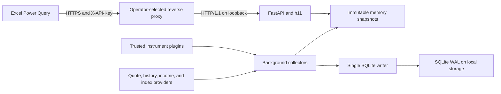

# QuickPrice

QuickPrice is a private, cache-first market data service designed for Excel
Power Query. Provider collectors continuously publish immutable snapshots to
memory and persist history to local SQLite. API requests read memory only, so
upstream latency and quota exhaustion do not enter the HTTP request path.

The service is intended for one operator and personal workbooks. It is not a
market-data redistribution platform, order-routing system, or remote execution
environment.

## Runtime profile

- CPython 3.14.6 free-threaded (`3.14.6t`) for production.
- FastAPI, Pydantic, Uvicorn with h11, aiohttp, and standard-library SQLite.
- One process, one asyncio event loop, background collectors, and one dedicated
  SQLite writer thread.
- API-key authentication, hostile-IP and per-key rate limits, provider quotas,
  single-flight requests, circuit breakers, and explicit stale-data metadata.
- Trusted Python entry-point plugins for instruments, provider routes,
  synthetic formulas, and income policies.
- Native Windows, WSL2, Linux, and macOS development workflows. Docker is not
  supported.

After importing the complete dependency graph, production readiness requires:

```text
Py_GIL_DISABLED == 1
sys._is_gil_enabled() is False
```

A standard CPython 3.14.6 interpreter is supported for differential testing,
but it does not satisfy the production readiness gate.

## Architecture



QuickPrice does not terminate TLS and has no runtime dependency on a specific
HTTP server. Nginx, Caddy, Apache, HAProxy, or a managed ingress can implement
the reverse-proxy contract described below.

## Built-in catalog

The built-in plugin contains 50 canonical instruments. Additional trusted
plugins can extend the catalog without modifying the application core.

| Family | Canonical symbols | Classification | Income policy |
|---|---|---|---|
| Spot crypto | `BTC:USDC`, `ETH:USDC`, `SOL:USDC`, `XMR:USDC` | `crypto / spot_crypto` | None |
| Liquid staking | `WBETH:USDC`, `STETH:USDC`, `WSTETH:USDC` | `crypto / liquid_staking_token` | Required annualized yield |
| Common stock | `AAPL:USD`, `MSFT:USD`, `GOOGL:USD`, `META:USD`, `NVDA:USD` | `equity / common_stock` | Latest regular quarterly cash dividend |
| Common stock | `AMZN:USD`, `TSLA:USD`, `SPCX:USD`, `MSTR:USD`, `CRCL:USD` | `equity / common_stock` | No current regular dividend; returns `null` |
| Equity ETF | `QQQM:USD` | `equity / equity_etf` | Latest regular cash dividend |
| Bond ETF | `BOXX:USD` | `bond / growth_bond_etf` | Treasury proxy minus expense ratio |
| Bond ETF | `SGOV:USD` | `bond / income_bond_etf` | Latest distribution annualized |
| Foreign exchange | Every directed pair among USD, EUR, GBP, HKD, SGD, and CNH | `fx / forex_pair` | None |

The FX catalog includes all 30 ordered pairs: `USD:EUR` and `EUR:USD` are
distinct instruments, as are every other base/counter direction.

`SPCX:USD` identifies Nasdaq-listed SpaceX following its June 2026 listing. All
common-stock symbols use USD quotes and the United States equity market
calendar.

Every instrument exposes a canonical `BASE:QUOTE` symbol, official English
name, English description, asset class, asset type, price basis, market
calendar, and income semantics. Provider-specific tickers and aliases remain
implementation metadata.

Liquid-staking instruments also declare how rewards accrue:

- `value_accruing`: rewards increase the value of a fixed unit count.
- `rebasing_balance`: rewards increase the holder's unit balance.
- `distributed_units`: rewards arrive as additional distributed units.
- `claimable_rewards`: rewards accrue outside the quoted unit.

Registry validation rejects any bond or liquid-staking asset without a usable
yield strategy.

## Data semantics

`changes.1h`, `4h`, `1d`, `1w`, `1mo`, and `1y` represent rolling 1-hour,
4-hour, 24-hour, 7-day, 30-day, and 365-day changes:

```text
(current price / latest valid price at or before the cutoff - 1) * 100
```

The API returns the actual `reference_price` and `reference_as_of`. A value of
`1.25` means 1.25 percent. Changes use unadjusted per-unit market prices and do
not mix in dividends, rebases, distributed units, or total return. Missing
history produces JSON `null`, not a fabricated zero.

SQLite retention defaults are 48 hours for 1-minute points, 45 days for
5-minute points, and 400 days for daily points. A closed market returns the
last valid price with `market_status=closed`. A provider outage may return the
last snapshot only when `quality.stale=true` discloses its age.

Income calculations are explicit:

- QQQM annualizes the latest ordinary cash dividend at quarterly frequency.
- AAPL, MSFT, GOOGL, META, and NVDA annualize the latest ordinary quarterly cash
  dividend. AMZN, TSLA, SPCX, MSTR, and CRCL return `dividend=null` because they
  do not currently have a regular dividend policy; QuickPrice does not
  fabricate a zero-yield distribution.
- SGOV annualizes the latest ordinary monthly distribution. It is not labeled
  as a 30-Day SEC Yield.
- BOXX uses FRED DGS3MO minus 0.1949 percentage points and identifies the result
  as a proxy.
- WBETH uses protocol exchange-rate growth, then signed Binance history when
  configured, then a trailing market-ratio estimate.
- stETH and wstETH use Lido's protocol APR as the primary yield source, with a
  trailing token-to-ETH market-ratio estimate as the final fallback.

The market-ratio fallback uses the configured window, 30 days by default, and
is marked `is_proxy=true`, `is_estimate=true`, and low confidence. For rebasing
or distributed-unit assets, price ratios may omit rewards received as new
units; the accrual mode in the response makes that limitation machine-readable.

## HTTP API

Production disables CORS, OpenAPI, and interactive documentation. Send the raw
QuickPrice credential only in a request header:

```http
X-API-Key: your-raw-api-key
```

Do not place credentials in URLs, query parameters, `WEBSERVICE()` formulas,
logs, or shared workbook cells.

### `GET /v1/quotes?symbols=...`

`symbols` accepts 1 to 100 comma-separated values. Inputs are normalized,
deduplicated, and resolved through the active plugin registry.

```bash
curl --get \
  --header "X-API-Key: ${QUICKPRICE_API_KEY}" \
  --data-urlencode 'symbols=SOL:USDC,WSTETH:USDC,SPCX:USD,EUR:GBP' \
  https://price.example.com/v1/quotes
```

A batch may partially succeed. HTTP 200 then carries `partial=true`, usable
rows in `data`, and per-symbol failures in `errors`. If no requested instrument
has ever produced its required data, the endpoint returns 503.

### `GET /v1/quotes/{symbol}`

Returns one configured instrument. Unknown symbols return 404; an instrument
without required price or income data returns 503.

### `GET /v1/instruments`

Returns the complete installed catalog and its names, descriptions,
classifications, price bases, change windows, reward mechanics, and income
policies.

### Response model

Every endpoint uses the same envelope:

```json
{
  "schema_version": "1.1",
  "request_id": "019c...",
  "generated_at": "2026-07-20T12:00:00Z",
  "partial": false,
  "data": [],
  "errors": []
}
```

Quote rows contain:

```text
symbol, base, quote, name, description, asset_class, asset_type
reward_accrual_mode, underlying_asset, price, price_basis, as_of, market_status
changes.{1h,4h,1d,1w,1mo,1y}
dividend
estimated_annual_yield.{percent,method,provider,fallback_level,rate_type,
observation_window_days,accrual_mode,underlying_asset,is_proxy,is_estimate,
accrual_index,components,quality,inputs}
source.{provider,feed,fallback_level,is_derived,components,license_scope,coverage}
quality.{stale,staleness_ms}
```

Amounts and percentages are JSON numbers. Timestamps use UTC RFC 3339. UUIDv7
request IDs appear in both the envelope and `X-Request-ID`.

| HTTP | Meaning |
|---|---|
| 200 | Complete or partial success |
| 400 / 422 | Invalid symbol batch or validation error |
| 401 | Missing or invalid API key |
| 404 | Unknown single symbol or route |
| 429 | Rate limited; honor `Retry-After` |
| 503 | Required price or income data has never been available |

## Provider model

Adapters implement uniform quote, history, dividend, yield, and accrual-index
contracts. Routing is configured per instrument and capability. The router
applies timeouts, durable quota accounting, single-flight request merging,
three-failure circuit breakers, 60-second half-open probes, and exponential
reconnect backoff.

The default route families are:

- BTC and ETH: Binance, Kraken, then CoinGecko for quotes; Binance then Kraken
  for history.
- SOL: Binance, Kraken, then CoinGecko for quotes; Binance then Kraken for
  history.
- XMR: Kraken then CoinGecko for quotes; Kraken for history.
- WBETH: Binance synthetic routes, then CoinGecko normalization for quotes;
  Binance synthetic routes for history.
- stETH and wstETH: CoinGecko price normalization, Lido protocol yield, then
  the declared 30-day market-ratio yield fallback.
- Common stocks and ETFs: Alpaca IEX, Twelve Data, then Alpha Vantage end-of-day
  data.
- FX: quota-bounded USD hub quotes and histories, with reciprocal and cross
  rates derived from common timestamped components.
- Dividend-paying common stocks, QQQM, and SGOV income: classified corporate
  actions and the last valid SQLite event.
- BOXX yield: FRED DGS3MO and the last valid SQLite metric.

Synthetic responses expose every component timestamp. Components that exceed
their configured age or skew limits are rejected. Free IEX is a single venue,
so responses preserve `feed=iex` and `coverage=single_venue`.

With the default 9,000-credit monthly CoinGecko budget, stETH and wstETH share
one batched upstream refresh on a 660-second cadence. Their source timestamps
and staleness remain explicit; a paid or plugin-provided feed can replace this
route when a tighter service level is required.

## Configuration and credentials

[.env.example](.env.example) contains non-secret application settings. It is a
configuration template, not an automatically loaded dotenv file. Supply those
values through the process environment or the host service manager.

Provider credentials have a separate lifecycle:

1. Copy [provider-keys.env.example](provider-keys.env.example) to
   `provider-keys.env` or another protected path.
2. Keep the populated file outside version control. The repository ignores
   `provider-keys.env` and `provider-keys.*.env`.
3. For direct Windows, macOS, or Linux runs, set
   `QUICKPRICE_PROVIDER_KEYS_FILE` to its path.
4. The supplied systemd unit reads `/etc/quickprice/provider-keys.env` as a
   second `EnvironmentFile`.

The file format is UTF-8 `NAME=VALUE`, with blank lines, full-line comments,
and optional single or double quotes. It performs no shell expansion. Only
recognized provider credential names are accepted. Process environment values
override file values, which allows a service manager or CI secret store to
replace individual credentials without editing the file.

`QUICKPRICE_API_KEY_HASHES` remains in application configuration because it is
the service's client-authentication state, not a market-data provider secret.
Generate a raw key and its stored hash with:

```bash
quickprice hash-key --generate
```

Store only the `sha256:<hex>` value on the server. Keep the raw key in the Excel
credential store or a password manager.

## Extending the catalog

Only entry points listed in `QUICKPRICE_ENABLED_PLUGINS` execute. Plugin wheels
are trusted code running inside the QuickPrice process and must be reviewed
before installation.

```bash
quickprice plugins list
quickprice plugins validate
```

Plugin validation covers canonical symbols and aliases, metadata completeness,
provider bindings, synthetic dependency cycles, and mandatory income routes.
`plugins validate` also builds the strict runtime graph, so required provider
configuration must be available before validation.

## Development

Synchronize the locked environment and run the complete verification suite:

```bash
uv sync --locked --all-extras --python 3.14.6t
uv run --frozen --python 3.14.6t ruff check .
uv run --frozen --python 3.14.6t ruff format --check .
uv run --frozen --python 3.14.6t pytest
```

Windows and WSL must use separate virtual environments and SQLite files. Keep
the WSL checkout and database in the Linux filesystem rather than `/mnt/c`.

```powershell
$env:UV_PROJECT_ENVIRONMENT = ".venv-win"
uv sync --locked --all-extras --python 3.14.6t
uv run --frozen --python 3.14.6t pytest
```

```bash
export UV_PROJECT_ENVIRONMENT=.venv-wsl
uv sync --locked --all-extras --python 3.14.6t
uv run --frozen --python 3.14.6t pytest
```

For local development, disable only the production gates that the local test
environment cannot satisfy and use a platform-local database:

```text
QUICKPRICE_PRODUCTION=false
QUICKPRICE_REQUIRE_FREE_THREADED=false
QUICKPRICE_DATABASE_PATH=<local path>
```

## Native deployment

Production uses the verified free-threaded Python source build and a single
QuickPrice process. The build script verifies the Python.org archive checksum
before configuring `--disable-gil --enable-optimizations --with-lto`:

```bash
sudo QUICKPRICE_PYTHON_PREFIX=/opt/python-3.14.6t \
  bash scripts/build_python314t.sh
```

The supplied Linux service layout is:

```text
/opt/quickprice                         application and virtual environment
/etc/quickprice/quickprice.env          non-secret runtime configuration
/etc/quickprice/provider-keys.env       provider credentials
/var/lib/quickprice                     SQLite database and backups
/etc/systemd/system/quickprice.service  application service unit
```

[deploy/systemd/quickprice.service](deploy/systemd/quickprice.service) binds
the application to `127.0.0.1:8080` and loads both configuration files. Install
these assets through the host's normal configuration-management workflow; the
repository does not prescribe account, firewall, DNS, or certificate tooling.

### Reverse-proxy contract

The selected HTTP server must:

- terminate HTTPS and forward to `http://127.0.0.1:8080` over HTTP/1.1;
- preserve the method, path, query, and `X-API-Key` request header;
- avoid shared caching of authenticated responses;
- redact `X-API-Key` and credential-like query parameters from access logs;
- apply appropriate request-header, body, upstream, and idle timeouts;
- expose `/health/live` and `/health/ready` while leaving `/internal/*`
  protected by QuickPrice authentication.

Optional starting points are provided for
[Nginx](examples/reverse-proxy/nginx.conf) and
[Caddy](examples/reverse-proxy/Caddyfile). They are examples, not runtime
dependencies or deployment requirements.

See [docs/operations.md](docs/operations.md) for backup, recovery, monitoring,
upgrade, quota, fallback, and incident procedures.

## Excel and curl clients

- [examples/QuickPrice.pq](examples/QuickPrice.pq) supports Microsoft 365 Excel
  Power Query on Windows and macOS, uses the `X-API-Key` header, and batches up
  to 100 symbols per request.
- [examples/quickprice.sh](examples/quickprice.sh) is a Bash and curl client for
  Linux, WSL, macOS, and Git Bash.

Configure the Power Query origin as Anonymous because the query supplies the
header. Use one workbook query and reference its result rather than creating an
HTTP request per cell.

## Verification and operations

CI exercises standard CPython 3.14.6 and free-threaded 3.14.6t across Windows,
Ubuntu, and macOS. It verifies formatting, tests, the systemd unit, shell
scripts, English-only repository text, and the native-only deployment policy.

The acceptance target on a 2-vCPU Linux host is 500 concurrent connections,
300 requests per second, hot-cache p95 below 100 ms, and unexpected errors
below 0.1 percent. The soak test must also confirm bounded memory, descriptors,
connections, task counts, SQLite queues, database size, and WAL size.

## Security and licensing boundary

- Provider credentials and raw QuickPrice keys must never appear in logs.
- Provider key files must be readable only by the QuickPrice service identity.
- The public reverse proxy must not inherit application or provider settings.
- Alpaca free IEX data is personal, single-venue data rather than SIP data.
- Provider data must not be redistributed without the required license.
- Fund issuer pages are not scraped; BOXX uses the documented FRED proxy.
- Binance fallback credentials must have no trading or withdrawal permission.
- Production disables CORS and API documentation and serves no trading routes.
