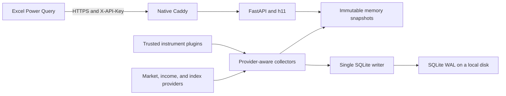

# QuickPrice

QuickPrice is a private, cache-first market price API for Excel. Background
collectors continuously update immutable in-memory snapshots and a local SQLite
database. HTTP handlers read memory only; they never wait for an upstream data
provider or SQLite.

QuickPrice is for one operator and personal workbooks. It is not a public market
data redistribution service, a trading system, or a remote code execution
platform.

## Highlights

- CPython 3.14.6 free-threaded (`3.14.6t`) in production.
- FastAPI, Pydantic, Uvicorn h11, aiohttp, and standard-library SQLite.
- One process, one asyncio event loop, and one dedicated SQLite writer thread.
- API-key authentication, per-key and hostile-IP rate limits, circuit breakers,
  provider quotas, fallback routing, and stale-data disclosure.
- Trusted Python package plugins add instruments, provider bindings, synthetic
  formulas, and income strategies without changing the application core.
- Native Linux deployment with systemd and Caddy. Docker is not supported.
- Native development and test workflows for Windows, WSL2, Linux, and macOS CI.

## Architecture



Production imports every dependency before it asserts:

```text
Py_GIL_DISABLED == 1
sys._is_gil_enabled() is False
```

Readiness fails if either assertion is false. A standard 3.14 interpreter is
supported for differential development tests only.

## Built-in instruments

The built-in plugin starts with these canonical symbols. Plugins may install
additional symbols without a core code change.

| Symbol | Name | Classification | Income policy |
|---|---|---|---|
| `BTC:USDC` | Bitcoin | `crypto / spot_crypto` | None |
| `ETH:USDC` | Ether | `crypto / spot_crypto` | None |
| `WBETH:USDC` | Wrapped Binance Beacon ETH | `crypto / liquid_staking_token` | Required staking yield |
| `QQQM:USD` | Invesco NASDAQ 100 ETF | `equity / equity_etf` | Latest regular cash dividend |
| `BOXX:USD` | Alpha Architect 1-3 Month Box ETF | `bond / growth_bond_etf` | Treasury proxy minus expense ratio |
| `SGOV:USD` | iShares 0-3 Month Treasury Bond ETF | `bond / income_bond_etf` | Latest distribution annualized |
| `USD:CNH` | United States Dollar / Offshore Chinese Yuan | `fx / forex_pair` | None |
| `HKD:CNH` | Hong Kong Dollar / Offshore Chinese Yuan | `fx / forex_pair` | None |

Every instrument has an immutable canonical `BASE:QUOTE` identity, an official
English `name`, and an English `description`. Provider tickers and aliases are
separate plugin metadata.

## Price changes and income

`changes.1h`, `4h`, `1d`, `1w`, `1mo`, and `1y` are rolling 1-hour, 4-hour,
24-hour, 7-day, 30-day, and 365-day changes:

```text
(current price / latest valid price at or before the cutoff - 1) * 100
```

The response includes the actual `reference_price` and `reference_as_of`.
`1.25` means 1.25%, not 0.0125. Changes use unadjusted per-unit market prices
and do not include dividends, rebases, distributed units, or total return.

History retention is 48 hours for 1-minute data, 45 days for 5-minute data, and
400 days for daily data. A missing reference produces JSON `null`, never a
fabricated zero.

Income rules are explicit:

- QQQM: latest ordinary cash payment times 4, divided by current price.
- SGOV: latest ordinary monthly distribution times 12, divided by current
  price. This is not a 30-Day SEC Yield.
- BOXX: FRED DGS3MO minus 0.1949 percentage points, marked as a proxy.
- WBETH: protocol exchange-rate yield. Ethereum contract data is primary,
  Binance signed rate history is fallback, and a trailing 30-day WBETH/ETH
  market-ratio estimate is the final permitted fallback.

The market-ratio fallback is marked `is_proxy=true`, `is_estimate=true`, and
uses method `staking_market_ratio_30d_annualized`. It is not mixed into market
price changes. Future staking-token plugins use the same fallback only when
their trusted plugin explicitly declares an underlying market pair. For
rebasing, distributed-unit, or claimable-reward tokens, that price-ratio
fallback may omit rewards delivered as additional units. It therefore remains
a low-confidence market proxy, never a protocol-reported rate, even though it
is permitted as the final fallback.

Liquid-staking plugins classify reward mechanics as `value_accruing`,
`rebasing_balance`, `distributed_units`, or `claimable_rewards`. Every bond and
liquid-staking token must declare a usable income policy or plugin validation
fails.

## API

Production disables CORS, OpenAPI, and interactive documentation. Send the raw
QuickPrice key only in a request header:

```http
X-API-Key: your-raw-api-key
```

Never place a key in a URL, query parameter, `WEBSERVICE()` formula, log, or
shared workbook.

### `GET /v1/quotes?symbols=...`

`symbols` is required and accepts 1 to 100 comma-separated symbols. Values are
normalized, deduplicated, and resolved through the active plugin registry.

```bash
curl --get \
  --header "X-API-Key: ${QUICKPRICE_API_KEY}" \
  --data-urlencode 'symbols=BTC:USDC,WBETH:USDC,QQQM:USD' \
  https://price.example.com/v1/quotes
```

Batch requests may partially succeed. They return HTTP 200, `partial=true`,
usable rows in `data`, and per-symbol entries in `errors`. If no requested
symbol has ever produced required data, the endpoint returns 503.

### `GET /v1/quotes/{symbol}`

Returns one configured symbol. Unknown symbols return 404 and missing required
data returns 503.

### `GET /v1/instruments`

Returns the complete installed catalog. The catalog documents classification,
name, description, price basis, change windows, provider-independent income
policy, and reward accrual mode.

### Response envelope

```json
{
  "schema_version": "1.1",
  "request_id": "019c...",
  "generated_at": "2026-07-20T12:00:00Z",
  "partial": false,
  "data": [],
  "errors": []
}
```

Quote rows contain:

```text
symbol, base, quote, name, description, asset_class, asset_type
reward_accrual_mode, underlying_asset, price, price_basis, as_of, market_status
changes.{1h,4h,1d,1w,1mo,1y}
dividend
estimated_annual_yield.{percent,method,provider,fallback_level,rate_type,
observation_window_days,accrual_mode,underlying_asset,is_proxy,is_estimate,
accrual_index,components,quality,inputs}
source.{provider,feed,fallback_level,is_derived,components,license_scope,coverage}
quality.{stale,staleness_ms}
```

Amounts and percentages are JSON numbers. Timestamps are UTC RFC 3339. UUIDv7
request IDs are returned in both the envelope and `X-Request-ID`.

Status codes:

| HTTP | Meaning |
|---|---|
| 200 | Complete or partial success |
| 400 / 422 | Invalid symbol batch or validation error |
| 401 | Missing or invalid API key |
| 404 | Unknown single symbol or route |
| 429 | Rate limited; honor `Retry-After` |
| 503 | Required price or income data has never been available |

## Provider routing

Providers implement uniform quote, history, dividend, yield, and accrual-index
contracts. Routes are ordered per instrument capability and include timeouts,
durable quotas, single-flight request merging, three-failure circuit breakers,
60-second half-open probes, and exponential reconnect backoff.

- BTC and ETH: Binance Spot, then Kraken, then CoinGecko aggregated quote.
- WBETH price: `WBETH/ETH * ETH/USDC`, then `WBETH/USDT / USDC/USDT`, then
  CoinGecko `WBETH/USD / USDC/USD`.
- Equities and ETFs: Alpaca free IEX, Twelve Data, then delayed Alpha Vantage
  end-of-day data.
- FX: Twelve Data, then low-frequency Alpha Vantage, then the last cache.
- QQQM and SGOV distributions: classified Alpaca corporate actions, then the
  last valid SQLite event. Unclassified Alpha Vantage distributions are not
  annualized.
- BOXX yield: FRED DGS3MO, then the last cache.

CoinGecko requests all active fallback assets in one shared request no more
than every five minutes and is not used as fake intraday history. Alpha FX is
limited to a six-hour fallback cadence. Free IEX is a single venue, so responses
retain `feed=iex` and `coverage=single_venue`.

## Trusted plugins

Only entry points listed in `QUICKPRICE_ENABLED_PLUGINS` execute. Plugin wheels
are deployment-time trusted code and run in the QuickPrice process; do not
install unreviewed packages.

```bash
quickprice plugins list
quickprice plugins validate
```

Plugin validation rejects duplicate symbols or aliases, invalid provider
bindings, synthetic dependency cycles, incomplete metadata, and missing bond or
staking income declarations. Provider routes remain executable trusted Python
code and must be reviewed before a plugin is allowlisted. `plugins validate`
also builds the strict runtime graph, so all credentials required by enabled
instruments must already be present in the environment.

## Native Linux deployment

Docker is intentionally unsupported. The production layout is:

```text
/opt/quickprice                 application checkout and virtual environment
/etc/quickprice/quickprice.env secrets and runtime configuration
/var/lib/quickprice             SQLite database and backups
/etc/systemd/system             QuickPrice unit
/etc/caddy/Caddyfile            native Caddy configuration
```

Install the native build dependencies for your distribution, then build the
verified free-threaded interpreter:

```bash
sudo QUICKPRICE_PYTHON_PREFIX=/opt/python-3.14.6t \
  bash scripts/build_python314t.sh
```

The script verifies the Python.org source archive SHA-256 before extraction and
builds with `--disable-gil --enable-optimizations --with-lto`.

Install uv, synchronize the locked environment, install the systemd assets and
Caddyfile, create separate protected environment files for QuickPrice and
Caddy, and start the services. The commands below assume that the reviewed
checkout is already at `/opt/quickprice` and that the native Caddy package has
created its `caddy` service account:

```bash
cd /opt/quickprice
sudo useradd --system --user-group --home-dir /opt/quickprice \
  --shell /usr/sbin/nologin quickprice
UV_PROJECT_ENVIRONMENT=.venv \
  uv sync --locked --no-dev --python /opt/python-3.14.6t/bin/python3.14t
sudo chown -R root:quickprice /opt/quickprice
sudo chmod -R o-rwx /opt/quickprice
sudo install -m 0644 deploy/systemd/quickprice.service /etc/systemd/system/
sudo install -m 0644 deploy/systemd/quickprice.tmpfiles.conf /usr/lib/tmpfiles.d/quickprice.conf
sudo install -d -m 0755 /etc/systemd/system/caddy.service.d
sudo install -m 0644 deploy/systemd/caddy-quickprice.conf \
  /etc/systemd/system/caddy.service.d/quickprice.conf
sudo install -m 0644 Caddyfile /etc/caddy/Caddyfile
sudo systemd-tmpfiles --create /usr/lib/tmpfiles.d/quickprice.conf
sudo install -o root -g quickprice -m 0640 .env.example \
  /etc/quickprice/quickprice.env
sudo install -o root -g caddy -m 0640 deploy/caddy.env.example \
  /etc/caddy/quickprice.env
sudoedit /etc/quickprice/quickprice.env
sudoedit /etc/caddy/quickprice.env
sudo systemctl daemon-reload
sudo systemctl enable --now quickprice caddy
```

If the `quickprice` account already exists, skip `useradd`. Never add the Caddy
account to the `quickprice` group and never expose application or provider
secrets through Caddy's environment.

Point the domain A/AAAA record at the VPS and expose only TCP 80/443 plus the
administrative SSH port. QuickPrice itself listens on `127.0.0.1:8080`.

See [docs/operations.md](docs/operations.md) for native backup, recovery,
monitoring, upgrade, and incident procedures.

## Windows and WSL development

Use separate environments and databases. Never share a virtual environment or
an actively written SQLite database between Windows and WSL.

Windows PowerShell:

```powershell
$env:UV_PROJECT_ENVIRONMENT = ".venv-win"
uv python install 3.14.6t
uv sync --locked --all-extras --python 3.14.6t
uv run --python 3.14.6t pytest
```

Start a local development server with non-production settings only after
providing a test API-key hash and a Windows-local database path:

```powershell
$env:QUICKPRICE_PRODUCTION = "false"
$env:QUICKPRICE_REQUIRE_FREE_THREADED = "false"
$env:QUICKPRICE_DATABASE_PATH = "$PWD\\data\\quickprice-win.sqlite3"
uv run --python 3.14.6t quickprice serve --host 127.0.0.1 --port 8080
```

WSL2 should clone the repository into its Linux filesystem, not `/mnt/c`:

```bash
git clone /mnt/c/Users/sunyiran/Documents/QuickPrice ~/src/QuickPrice
cd ~/src/QuickPrice
export UV_PROJECT_ENVIRONMENT=.venv-wsl
uv python install 3.14.6t
uv sync --locked --all-extras --python 3.14.6t
uv run --python 3.14.6t pytest
```

Run WSL commands from the WSL shell and keep its database under the Linux home
directory, for example `~/var/quickprice/quickprice-wsl.sqlite3`.

## Excel and curl examples

- [examples/QuickPrice.pq](examples/QuickPrice.pq) supports current Microsoft
  365 Excel Power Query on Windows and macOS. It requires an explicit symbol
  list and automatically sends batches of 100.
- [examples/quickprice.sh](examples/quickprice.sh) is a Bash/curl example for
  Linux, WSL, and Git Bash.

Configure the Power Query origin as Anonymous. The query itself supplies the
`X-API-Key` header. Use one shared workbook query and reference its result
instead of issuing one HTTP call per cell.

## Development and verification

```bash
uv sync --locked --all-extras
uv run ruff check .
uv run ruff format --check .
uv run pytest
```

The CI matrix covers standard 3.14.6 on Windows, Ubuntu, and macOS plus 3.14.6t
on Windows and Ubuntu. It also validates native Caddy configuration and shell
scripts without using Docker.

The target 2 vCPU Linux acceptance profile is 500 concurrent connections,
300 RPS, hot-cache p95 below 100 ms, and unexpected errors below 0.1%. Run the
24-hour soak only in an isolated window with application rate limiting disabled,
then restore the production limit immediately.

## Data license and security boundary

- API keys are configured only as SHA-256 hashes and compared in constant time.
- Provider and raw QuickPrice credentials must never appear in logs.
- Alpaca free IEX data is personal/internal single-venue data, not SIP data.
- Do not redistribute provider data or expand this deployment to anonymous or
  third-party users without obtaining the required licenses.
- Do not scrape fund issuer pages. BOXX uses the documented FRED proxy only.
- Binance staking fallback credentials must have no trade or withdrawal rights.
- Caddy is the only public listener; production disables CORS and API docs.
