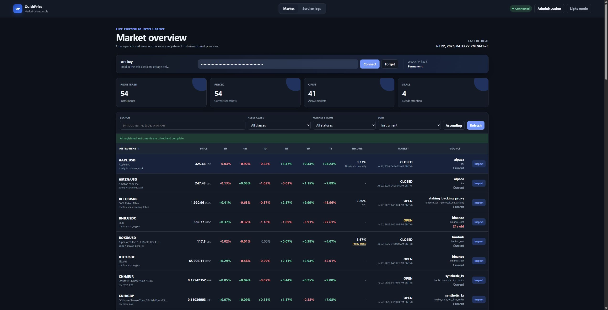
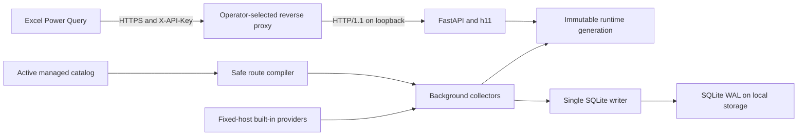

# QuickPrice

QuickPrice is a private, cache-first market data service designed for Excel
Power Query. Provider collectors continuously publish immutable snapshots to
memory and persist history to local SQLite. API requests read memory only, so
upstream latency and quota exhaustion do not enter the HTTP request path.

The service is intended for one operator and personal workbooks. It is not a
market-data redistribution platform, order-routing system, or remote execution
environment.

QuickPrice also includes a responsive operator dashboard for inspecting live
quotes, rolling returns, income metrics, market status, freshness, and provider
provenance.

[](docs/assets/quickprice-dashboard.png)

<p align="center"><em>QuickPrice operator dashboard - sortable live quotes with explicit income, freshness, and source metadata.</em></p>

## Runtime profile

- CPython 3.14.6 free-threaded (`3.14.6t`) for production.
- FastAPI, Pydantic, Uvicorn with h11, aiohttp, and standard-library SQLite.
- One process, one asyncio event loop, background collectors, and one dedicated
  SQLite writer thread.
- Essential history columns are restored from SQLite in bounded per-symbol
  batches. Rolling-change cutoffs are cached per quote minute, so stream updates
  do not copy or sort complete history rings.
- API-key authentication, hostile-IP and per-key rate limits, provider quotas,
  single-flight requests, circuit breakers, and explicit stale-data metadata.
- A revisioned, data-driven instrument catalog with fixed provider descriptors,
  bounded synthetic recipes, shadow warm-up, and atomic hot activation.
- Trusted Python entry-point plugins only when a completely new provider or
  executable integration is required.
- Native Windows, WSL2, Linux, and macOS development workflows; Docker is not supported.

After importing the complete dependency graph, production readiness requires:

```text
Py_GIL_DISABLED == 1
sys._is_gil_enabled() is False
```

A standard CPython 3.14.6 interpreter is supported for differential testing,
but it does not satisfy the production readiness gate.

## Architecture



QuickPrice does not terminate TLS and has no runtime dependency on a specific
HTTP server. Nginx, Caddy, Apache, HAProxy, or a managed ingress can implement
the reverse-proxy contract described below.

## Built-in catalog

The built-in seed contains 54 canonical instruments. The administrator console
can add further instruments supported by installed providers without a code
change or process restart. Built-in identity, classification, and income
semantics remain immutable; their enabled state, bounded collection cadence,
and compatible provider order are operator-managed.

| Family | Canonical symbols | Classification | Income policy |
|---|---|---|---|
| Spot crypto | `BTC:USDC`, `ETH:USDC`, `SOL:USDC`, `XMR:USDC`, `POL:USDC`, `BNB:USDC`, `TRX:USDC` | `crypto / spot_crypto` | None |
| Liquid staking | `WBETH:USDC`, `BETH:USDC`, `STETH:USDC`, `WSTETH:USDC` | `crypto / liquid_staking_token` | Required annualized yield |
| Common stock | `AAPL:USD`, `MSFT:USD`, `GOOGL:USD`, `META:USD`, `NVDA:USD` | `equity / common_stock` | Latest regular quarterly cash dividend |
| Common stock | `AMZN:USD`, `TSLA:USD`, `SPCX:USD`, `MSTR:USD`, `CRCL:USD` | `equity / common_stock` | No current regular dividend; returns `null` |
| Equity ETF | `QQQM:USD` | `equity / equity_etf` | Latest regular cash dividend |
| Bond ETF | `BOXX:USD` | `bond / growth_bond_etf` | Treasury proxy minus expense ratio |
| Bond ETF | `SGOV:USD` | `bond / income_bond_etf` | Latest distribution annualized |
| Foreign exchange | Every directed pair among USD, EUR, GBP, HKD, SGD, and CNH | `fx / forex_pair` | None |

The FX catalog includes all 30 ordered pairs: `USD:EUR` and `EUR:USD` are
distinct instruments, as are every other base/counter direction.

`SPCX:USD` identifies Nasdaq-listed SpaceX following its June 2026 listing. All
common-stock symbols use USD quotes and the United States equity market
calendar.

Every instrument exposes a canonical `BASE:QUOTE` symbol, official English
name, English description, asset class, asset type, price basis, market
calendar, and income semantics. Provider-specific tickers and aliases remain
implementation metadata.

Liquid-staking instruments also declare how rewards accrue:

- `value_accruing`: rewards increase the value of a fixed unit count.
- `rebasing_balance`: rewards increase the holder's unit balance.
- `distributed_units`: rewards arrive as additional distributed units.
- `claimable_rewards`: rewards accrue outside the quoted unit.

Registry validation rejects any bond or liquid-staking asset without a usable
yield strategy.

## Data semantics

`changes.1h`, `4h`, `1d`, `1w`, `1mo`, and `1y` represent rolling 1-hour,
4-hour, 24-hour, 7-day, 30-day, and 365-day changes:

```text
(current price / latest valid price at or before the cutoff - 1) * 100
```

The API returns the actual `reference_price` and `reference_as_of`. A value of
`1.25` means 1.25 percent. Changes use unadjusted per-unit market prices and do
not mix in dividends, rebases, distributed units, or total return. Missing
history produces JSON `null`, not a fabricated zero.

SQLite retention defaults are 48 hours for 1-minute points, 45 days for
5-minute points, and 400 days for daily points. Maintenance applies the same
windows to active memory rings. Archiving an instrument releases its in-memory
state after activation while SQLite keeps the retained rows available for a
future reactivation. A closed market returns the last valid price with
`market_status=closed`. A provider outage may return the last snapshot only when
`quality.stale=true` discloses its age.

Income calculations are explicit:

- QQQM annualizes the latest ordinary cash dividend at quarterly frequency.
- AAPL, MSFT, GOOGL, META, and NVDA annualize the latest ordinary quarterly cash
  dividend. AMZN, TSLA, SPCX, MSTR, and CRCL return `dividend=null` because they
  do not currently have a regular dividend policy; QuickPrice does not
  fabricate a zero-yield distribution.
- SGOV annualizes the latest ordinary monthly distribution. It is not labeled
  as a 30-Day SEC Yield.
- BOXX uses FRED DGS3MO minus 0.1949 percentage points and identifies the result
  as a proxy.
- WBETH uses [signed Binance rate history](https://developers.binance.com/en/docs/catalog/investment-and-services-staking/api/rest-api/eth-staking#get-wbeth-rate-history)
  when configured, then protocol exchange-rate growth, then a trailing
  market-ratio estimate. Binance's `annualPercentageRate` is already an annual
  fraction: `0.023` means 2.3%, not a daily rate to annualize again. The on-chain
  fallback's daily exchange-rate event remains current for 36 hours: one normal
  24-hour publication interval plus 12 hours of scheduling and RPC/indexing
  grace.
- BETH uses OKX's public 30-day ETH staking rate history and selects the latest
  provider-reported annualized rate. OKX distributes rewards as additional
  BETH units, so QuickPrice reports `rate_type=apr` and
  `reward_accrual_mode=distributed_units`. It deliberately has no market-ratio
  yield fallback because a price ratio does not measure separately distributed
  units.
- stETH and wstETH use Lido's protocol APR as the primary yield source, with a
  trailing token-to-ETH market-ratio estimate as the final fallback.

The market-ratio fallback uses the configured window, 30 days by default, and
is marked `is_proxy=true`, `is_estimate=true`, and low confidence. For rebasing
or distributed-unit assets, price ratios may omit rewards received as new
units; the accrual mode in the response makes that limitation machine-readable.

## HTTP API

Production disables CORS, OpenAPI, and interactive documentation. Send the raw
QuickPrice credential only in a request header:

```http
X-API-Key: your-raw-api-key
```

Do not place credentials in URLs, query parameters, `WEBSERVICE()` formulas,
logs, or shared workbook cells.

### `GET /v1/quotes?symbols=...`

`symbols` accepts 1 to 100 comma-separated values. Inputs are normalized,
deduplicated, and resolved through the active plugin registry.

```bash
curl --get \
  --header "X-API-Key: ${QUICKPRICE_API_KEY}" \
  --data-urlencode 'symbols=SOL:USDC,WSTETH:USDC,SPCX:USD,EUR:GBP' \
  https://price.example.com/v1/quotes
```

A batch may partially succeed. HTTP 200 then carries `partial=true`, usable
rows in `data`, and per-symbol failures in `errors`. If no requested instrument
has ever produced its required data, the endpoint returns 503.

### `GET /v1/quotes/{symbol}`

Returns one configured instrument. Unknown symbols return 404; an instrument
without required price or income data returns 503.

### `GET /v1/instruments`

Returns the complete active catalog and its names, descriptions,
classifications, price bases, change windows, reward mechanics, and income
policies.

### `GET /v1/access`

Returns the authenticated API key's non-secret display name and expiration.
`is_permanent=true` and `expires_at=null` identify a key with no expiration.
The dashboard refreshes this metadata while connected so administrator changes
are reflected without exposing the key identifier, hash, or plaintext value.

### Response model

Every endpoint uses the same envelope:

```json
{
  "schema_version": "1.1",
  "request_id": "019c...",
  "generated_at": "2026-07-20T12:00:00Z",
  "partial": false,
  "data": [],
  "errors": []
}
```

Quote rows contain:

```text
symbol, base, quote, name, description, asset_class, asset_type
reward_accrual_mode, underlying_asset, price, price_basis, as_of, market_status
changes.{1h,4h,1d,1w,1mo,1y}
dividend
estimated_annual_yield.{percent,method,provider,fallback_level,rate_type,
observation_window_days,accrual_mode,underlying_asset,is_proxy,is_estimate,
accrual_index,components,quality,inputs}
source.{provider,feed,fallback_level,is_derived,components,license_scope,coverage}
quality.{stale,staleness_ms}
```

Amounts and percentages are JSON numbers. Timestamps use UTC RFC 3339. UUIDv7
request IDs appear in both the envelope and `X-Request-ID`.

| HTTP | Meaning |
|---|---|
| 200 | Complete or partial success |
| 400 / 422 | Invalid symbol batch or validation error |
| 401 | Missing or invalid API key |
| 404 | Unknown single symbol or route |
| 429 | Rate limited; honor `Retry-After` |
| 503 | Required price or income data has never been available |

## Dashboard

QuickPrice serves a compact operator dashboard at `/dashboard`. It is a
read-only client of the same HTTP API used by Excel: the static HTML, CSS, and
JavaScript shell contains no instrument data, cached prices, API keys, provider
credentials, or other runtime secrets. It retrieves the active catalog and
quotes only after the operator authenticates.

The dashboard deliberately presents one table covering every installed
instrument. It does not render charts or introduce a separate analytics API.
Filtering, sorting, freshness, market status, source, fallback, dividend, and
estimated-yield fields remain grounded in the existing JSON responses.

Authentication and browser state follow these boundaries:

- The operator enters a raw QuickPrice key in the dashboard. The key is held in
  `sessionStorage`, sent as `X-API-Key`, and scoped to the current browser tab
  session. It is not embedded in static assets, persisted in `localStorage`, or
  placed in a URL, query string, fragment, cookie, or server-rendered document.
- The connected view shows whether the current key is permanent or its exact
  expiration time. This comes from the protected `/v1/access` endpoint and
  contains no key material.
- Closing the tab clears the session key according to normal browser
  `sessionStorage` behavior. Shared or untrusted browser profiles remain
  inappropriate places to enter credentials.
- The light/dark theme preference is non-sensitive and persists independently
  across visits. Theme persistence never includes the API key.
- The Live log tab opens an authenticated Server-Sent Events stream from
  `/internal/logs/stream`. It uses the same key header and reconnects from the
  last event identifier when possible; credentials never become URL state.

For a local UI preview with deterministic data, run the test fixture on
loopback:

```bash
uv run --frozen uvicorn tests.load_fixture_app:app \
  --host 127.0.0.1 --port 8080
```

Open `http://127.0.0.1:8080/dashboard` and use
`test-key-with-enough-entropy`. This is a development fixture with seeded data
and disabled rate limiting, not a production configuration; do not bind it to
a public or shared interface.

## Provider model

Adapters implement uniform quote, history, dividend, yield, and accrual-index
contracts. Provider modules contain no built-in trading-pair tables; each
runtime generation injects validated vendor-symbol bindings from the managed
catalog. Routing is configured per instrument and capability. The router
applies timeouts, durable quota accounting, single-flight request merging,
three-failure circuit breakers, and half-open probes. Identifiable connection,
DNS, TLS, proxy, and timeout failures are retried indefinitely at a fixed
interval of at most 30 seconds; explicit HTTP, quota, and malformed-response
failures retain bounded exponential backoff. The multi-request Ethereum
exchange-rate algorithm has a
separate finite route budget derived from its per-request timeout; every JSON-
RPC request remains subject to the shorter provider request timeout.

For Binance and Kraken, a fresh primary WebSocket quote suppresses the
duplicate REST quote poll. Suppression is bounded by the quote source time and
the instrument staleness threshold, is periodically rechecked, and is cleared
on disconnect. It never applies to fallback providers, unsolicited symbols, or
internal synthetic-route components.

The default route families are:

- BTC, ETH, SOL, and BNB: Binance, Kraken, then CoinGecko for quotes; Binance
  then Kraken for history.
- POL and TRX: Binance then CoinGecko for quotes; Binance only for history.
- XMR: Kraken then CoinGecko for quotes; Kraken for history.
- WBETH: Binance synthetic routes, then CoinGecko normalization for quotes;
  Binance synthetic routes for history; signed Binance APR, on-chain exchange-
  rate APY, then the declared 30-day market-ratio proxy for yield.
- BETH: same-venue OKX `BETH/ETH * ETH/USDC`, then
  `BETH/USDT / USDC/USDT`; CoinGecko market price, then an explicitly derived
  1:1 ETH protocol-backing proxy are quote fallbacks. CoinGecko remains the
  history fallback. Yield uses only OKX's provider-reported ETH staking rate,
  while SQLite can retain the last successful metric with explicit stale
  metadata during an outage.
- stETH and wstETH: CoinGecko normalized market prices remain preferred. When
  that endpoint is unreachable, stETH uses an explicitly derived 1:1 ETH
  backing proxy and wstETH multiplies the current ETH quote by Lido's on-chain
  `stEthPerToken` ratio. Both expose their components and
  `price_basis=protocol_backing_proxy`; neither is presented as a traded market
  price. Lido remains the primary protocol-yield source. Value-accruing wstETH
  may finally use the declared 30-day market-ratio yield proxy; rebasing stETH
  does not use a price-ratio yield proxy because rewards accrue as units rather
  than unit-price appreciation.
- Common-stock and ETF quotes: Alpaca IEX, Finnhub, Twelve Data, then Alpha
  Vantage end-of-day data. History remains Alpaca, Twelve Data, then Alpha
  Vantage because [Finnhub's free plan](https://finnhub.io/pricing) does not
  include OHLC history.
- FX: quota-bounded USD hub quotes and histories. Only the five USD-spoke
  histories are retained in memory; reciprocal and cross-pair cutoff references
  are derived virtually from common timestamped components with the same skew
  rules.
- Dividend-paying common stocks, QQQM, and SGOV income: classified corporate
  actions and the last valid SQLite event.
- BOXX yield: FRED DGS3MO and the last valid SQLite metric.

Synthetic responses expose every component timestamp. Components that exceed
their configured age or skew limits are rejected. Free IEX is a single venue,
so responses preserve `feed=iex` and `coverage=single_venue`.

Finnhub is deliberately quote-only. When it is the first configured listed-
security provider, QuickPrice uses Finnhub's WebSocket feed for up to 50
symbols. REST fallback uses `X-Finnhub-Token` header authentication, a durable
60-call-per-minute gate, a 29-call-per-second sliding-window burst gate, a
catalog-scaled polling floor, and a short negative cache. Recent stream trades
suppress REST polling, and closed-market REST checks run no more than every 15
minutes. Quotes without a positive vendor timestamp fail closed instead of
being assigned a synthetic receipt time. Finnhub does not document whether its
US real-time quote is SIP, single-venue, or aggregated, so responses use
`coverage=us_realtime_unspecified` rather than making a stronger claim. See the
[Finnhub API documentation](https://finnhub.io/docs/api) and
[rate-limit policy](https://finnhub.io/docs/api/rate-limit).

Alpaca streaming uses a deterministic prefix of at most 30 symbols by default.
Additional listed instruments remain active through a shared REST scheduler
paced at 180 calls per minute; both limits are explicit managed settings so an
operator can match an authorized Alpaca plan without changing code. The same
gate covers quote, history, dividend, and market-clock requests, including
catalog warm-up, rather than allowing a large import to create a cold-start
burst.

With the default 9,000-credit monthly CoinGecko budget and healthy primary spot
providers, stETH and wstETH drive one all-symbol quote batch on a 660-second
cadence. Ordinary spot fallback demand reuses that cache; its refresh floor and
the durable monthly budget prevent an unbounded request fan-out. Failed shared
quote refreshes caused by a connection, TLS, DNS, proxy, or timeout error are
retried indefinitely every five minutes. Explicit upstream responses retain
the ten-minute quota-safe backoff and all attempts remain subject to the hard
local daily credit budget. CoinGecko
ordinary spot routes are aggregated, USD-to-USDC-normalized quote fallbacks
only and are never used as ordinary spot history. Source timestamps and
staleness remain explicit, and a paid or plugin-provided feed can replace this
route when a tighter service level is required.

Data-driven CoinGecko bindings support direct `*:USD` quotes and USD-to-USDC
normalization for `*:USDC`. Other quote currencies require a controlled
synthetic definition or a provider that natively lists the pair.

## Configuration and credentials

[.env.example](.env.example) contains non-secret application settings. It is a
configuration template, not an automatically loaded dotenv file. Supply those
values through the process environment or the host service manager.

Provider credentials have a separate, write-only lifecycle:

1. Copy [provider-keys.env.example](provider-keys.env.example) to a protected
   path for initial bootstrap, or enter replacements in `/admin` after the
   administrator control plane is configured.
2. Keep the populated file outside version control. The repository ignores
   `provider-keys.env` and `provider-keys.*.env`.
3. For direct Windows, macOS, or Linux runs, set
   `QUICKPRICE_PROVIDER_KEYS_FILE` to its path.
4. The supplied systemd unit points QuickPrice at
   `/var/lib/quickprice/config/provider-keys.env`. The file is owned by the
   unprivileged service account and is never interpreted by a shell.

The file format is UTF-8 `NAME=VALUE`, with blank lines, full-line comments,
and optional single or double quotes. It performs no shell expansion. Only
recognized provider credential names are accepted. Process environment values
override file values, which allows a service manager or CI secret store to
replace individual credentials without editing the file.

The administrator API never returns provider values. It reports only
configured/unconfigured state and whether a value is externally managed.
Replacements are schema-checked, written with an atomic mode-0600 replacement,
and become active after a host-managed service restart. A process environment
value remains authoritative and deliberately cannot be overwritten in the UI.
Network destinations, including `QUICKPRICE_ETHEREUM_RPC_URLS`, remain
host-managed even when stored in the same protected file; the web console does
not expose or modify them.

Provider egress can use an explicit HTTP CONNECT proxy without changing the
inbound reverse proxy. Set `QUICKPRICE_PROVIDER_PROXY_URL` to proxy every REST
and WebSocket provider by default. Set `QUICKPRICE_PROVIDER_PROXY_NAMES` to a
comma-separated allowlist when only selected providers should use it. Built-in
names include `binance`, `kraken`, `coingecko`, `binance_wbeth_rate`,
`ethereum_exchange_rate`, `staking_backing_proxy`, `lido`, `alpaca`, `finnhub`,
`twelve_data`, `alpha_vantage`, and `fred`. A plugin installer can apply the same
policy with `settings.proxy_url_for_provider(name)`. Treat an authenticated
proxy URL as a secret even though local unauthenticated proxy addresses normally
belong in the non-secret application configuration.

`QUICKPRICE_API_KEY_HASHES` is a one-time compatibility bootstrap. On the first
schema-v2 start, its hashes are imported into SQLite and a durable bootstrap
marker prevents later environment changes from silently adding credentials.
After bootstrap, create, import, expire, or revoke client keys in `/admin`.
Generated raw keys are displayed once and only SHA-256 digests are retained.
For an initial client key, generate a raw value and stored digest with:

```bash
quickprice hash-key --generate
```

Store only the `sha256:<hex>` value on the server. Keep the raw key in the Excel
credential store or a password manager.

## Secure administration

`/admin` is a separate control plane. Quote API keys cannot authorize any
administrator endpoint. Bootstrap administrator credentials only from a local
terminal on the host or another trusted workstation:

```bash
quickprice admin-credentials --origin https://quickprice.example.com
```

The command generates a 256-bit administrator key, an scrypt verifier, a
160-bit TOTP seed, and an `otpauth://` enrollment URI. Save the raw key in a
password manager, enroll the TOTP seed immediately, and place only the emitted
`QUICKPRICE_ADMIN_*` configuration values in the root-controlled
`/etc/quickprice/admin-auth.env`; [admin-auth.env.example](admin-auth.env.example)
documents the boundary without containing usable credentials. The web UI
cannot read or change this file.

Successful verification creates an opaque process-local session. The browser
receives only a `Secure`, `HttpOnly`, `SameSite=Strict`, path-root cookie and an
in-memory synchronizer token. Administrator mutations require the token,
`application/json`, the exact configured origin, and a same-origin Fetch
context. Sessions have 15-minute idle and one-hour absolute defaults, are
bounded in memory, and disappear on restart. Login and mutation budgets are
rate-limited independently. A pre-parse guard also rate-limits every admin API
request, rejects chunked mutation bodies, and enforces a 64 KiB body limit
without trusting `Content-Length`. Only the exact instrument-catalog import
endpoint receives a separate 8 MiB limit. TOTP codes cannot be replayed within
the running process.

`quickprice serve` disables Uvicorn's implicit forwarding-header trust.
QuickPrice accepts `X-Real-IP` and `X-Forwarded-Proto` only from exact addresses
listed in the root-controlled `QUICKPRICE_ADMIN_TRUSTED_PROXY_IPS` setting. The
supplied loopback Nginx/systemd layout explicitly trusts `127.0.0.1`; direct
application deployments should leave the list empty.

The control plane deliberately exposes only bounded operations:

- client API-key creation, import, expiry changes, and immediate revocation;
- write-only provider credential replacement and clearing;
- declarative instrument creation, editing, archiving, import, export,
  validation, hot activation, and rollback;
- an allowlist of non-secret runtime and provider-routing settings;
- redacted audit events and in-memory provider availability, latency,
  fallback, circuit, stream, and locally accounted credit statistics.

Provider success is an operation-result rate, not a claim about exchange
uptime. Provider-operation counts and upstream HTTP samples remain separate;
the headline count uses operations only. Stream connection state and reconnects
are reported independently. P50/P95 values use at most the latest 2,048 samples
per provider surface, local quota snapshots refresh every 60 seconds, and the
response includes the quota observation time. Locally reserved credits are not
provider billing statements.

It cannot install plugins, import Python objects, edit arbitrary files, choose
arbitrary provider/RPC destinations, execute commands, modify Nginx/systemd,
or restart itself. Configuration and provider-key changes remain revisioned
and restart-bound. Instrument catalog activation is an in-process atomic
generation switch after validation and shadow warm-up.
For a public deployment, place an identity-aware proxy, mTLS, VPN, or strict IP
policy in front of `/admin` as a second boundary. TOTP is strong protection
against a stolen administrator key but is not phishing-resistant.

## Managed instrument catalog

`/admin` provides a staged catalog workflow for instruments supported by the
built-in providers. It includes provider capability discovery, fixed-host
symbol search, recommended routes, local credit estimates, strict JSON import
and export, validation, shadow warm-up, activation jobs, and rollback to the
last-known-good generation.

Public requests capture one immutable generation. They therefore observe the
complete old catalog or the complete new catalog, never a partially activated
mix. A draft is private until activation; an archived instrument disappears
from public APIs after activation while its retained SQLite history is left to
the normal retention policy. Failed validation or warm-up leaves the active
generation and readiness unchanged.

The validation result and activation job expose a scale-aware warm-up plan.
`QUICKPRICE_CATALOG_WARM_TIMEOUT_SECONDS` is a minimum deadline: QuickPrice
raises it for large changed sets according to bounded concurrency, compiled
provider attempts and known rate gates, and paces primary minute-limited routes.
An intentionally all-disabled migrated catalog remains a valid empty active
generation; default batch endpoints return HTTP 200 with empty arrays.

The managed boundary accepts only installed provider identifiers, validated
vendor symbols, controlled income strategies, and `inverse`, `multiply`, or
`divide` recipes with at most two inputs. It rejects URLs, headers, credentials,
module paths, executable expressions, unknown fields, dependency cycles, and
catalogs above the configured structural and credit limits. See
[docs/instrument-catalog.md](docs/instrument-catalog.md) for the manifest,
workflow, endpoints, and recovery model.

## Extending providers

Only entry points listed in `QUICKPRICE_ENABLED_PLUGINS` execute. Plugin wheels
are trusted code running inside the QuickPrice process and must be reviewed
before installation.

```bash
quickprice plugins list
quickprice plugins validate
```

Plugin validation covers canonical symbols and aliases, metadata completeness,
provider bindings, synthetic dependency cycles, and mandatory income routes.
`plugins validate` also builds the strict runtime graph, so required provider
configuration must be available before validation.

## Development

Synchronize the locked environment and run the complete verification suite:

```bash
uv sync --locked --all-extras --python 3.14.6t
uv run --frozen --python 3.14.6t ruff check .
uv run --frozen --python 3.14.6t ruff format --check .
uv run --frozen --python 3.14.6t pytest
```

Windows and WSL must use separate virtual environments and SQLite files. Keep
the WSL checkout and database in the Linux filesystem rather than `/mnt/c`.

```powershell
$env:UV_PROJECT_ENVIRONMENT = ".venv-win"
uv sync --locked --all-extras --python 3.14.6t
uv run --frozen --python 3.14.6t pytest
```

```bash
export UV_PROJECT_ENVIRONMENT=.venv-wsl
uv sync --locked --all-extras --python 3.14.6t
uv run --frozen --python 3.14.6t pytest
```

For local development, disable only the production gates that the local test
environment cannot satisfy and use a platform-local database:

```text
QUICKPRICE_PRODUCTION=false
QUICKPRICE_REQUIRE_FREE_THREADED=false
QUICKPRICE_DATABASE_PATH=<local path>
```

## Native deployment

Production uses the verified free-threaded Python source build and a single
QuickPrice process. The build script verifies the Python.org archive checksum
before configuring `--disable-gil --enable-optimizations --with-lto`:

```bash
sudo QUICKPRICE_PYTHON_PREFIX=/opt/python-3.14.6t \
  bash scripts/build_python314t.sh
```

The supplied Linux service layout is:

```text
/opt/quickprice                         application and virtual environment
/etc/quickprice/quickprice.env          non-secret runtime configuration
/etc/quickprice/admin-auth.env          root-controlled administrator factors
/var/lib/quickprice/config/quickprice.env       web-managed allowlisted settings
/var/lib/quickprice/config/provider-keys.env    web-managed provider credentials
/var/lib/quickprice/config/instruments.json     revisioned managed catalog
/var/lib/quickprice                     SQLite database, configuration, backups
/etc/systemd/system/quickprice.service  application service unit
```

[deploy/systemd/quickprice.service](deploy/systemd/quickprice.service) binds
the application to `127.0.0.1:8080`, loads root-controlled launch and
administrator configuration, and grants writes only below `/var/lib/quickprice`. Install
these assets through the host's normal configuration-management workflow; the
repository does not prescribe account, firewall, DNS, or certificate tooling.

### Reverse-proxy contract

The selected HTTP server must:

- terminate HTTPS and forward to `http://127.0.0.1:8080` over HTTP/1.1;
- preserve the exact public host and `X-Forwarded-Proto`, and overwrite rather
  than append client-controlled forwarding headers; list the proxy's exact
  peer address in `QUICKPRICE_ADMIN_TRUSTED_PROXY_IPS`;
- restore the real visitor address only through an explicitly trusted proxy
  chain; when using Cloudflare, maintain its published address allowlist and
  block direct origin bypass;
- preserve the method, path, query, and `X-API-Key` request header;
- avoid shared caching of authenticated responses;
- cap ordinary administrator request bodies at 64 KiB, allow at most 8 MiB on
  the exact `/admin-api/instrument-catalog/import` path, and never cache
  `/admin` or `/admin-api/*`;
- redact `X-API-Key` and credential-like query parameters from access logs;
- apply appropriate request-header, body, upstream, and idle timeouts;
- stream `/internal/logs/stream` without response buffering, transformation,
  shared caching, or an upstream read/idle timeout that terminates the SSE
  connection, and preserve `Last-Event-ID` on reconnect;
- expose `/health/live` and `/health/ready` while leaving `/internal/*`
  protected by QuickPrice authentication.

Optional starting points are provided for
[Nginx](examples/reverse-proxy/nginx.conf) and
[Caddy](examples/reverse-proxy/Caddyfile). They are examples, not runtime
dependencies or deployment requirements.

See [docs/operations.md](docs/operations.md) for backup, recovery, monitoring,
upgrade, quota, fallback, and incident procedures.

## Excel and curl clients

- [examples/QuickPrice.pq](examples/QuickPrice.pq) supports Microsoft 365 Excel
  Power Query on Windows and macOS, uses the `X-API-Key` header, and batches up
  to 100 symbols per request.
- [examples/quickprice.sh](examples/quickprice.sh) is a Bash and curl client for
  Linux, WSL, macOS, and Git Bash.

Configure the Power Query origin as Anonymous because the query supplies the
header. Use one workbook query and reference its result rather than creating an
HTTP request per cell.

## Verification and operations

CI exercises standard CPython 3.14.6 on Windows, Ubuntu, and macOS, plus
free-threaded 3.14.6t on Windows and Ubuntu. It verifies formatting, tests, the
systemd unit, shell scripts, English-only repository text, and the native-only
deployment policy.

The acceptance target on a 2-vCPU Linux host is 500 concurrent connections,
300 requests per second, hot-cache p95 below 100 ms, and unexpected errors
below 0.1 percent. The soak test must also confirm bounded memory, descriptors,
connections, task counts, SQLite queues, database size, and WAL size.

## Security and licensing boundary

- Provider credentials and raw QuickPrice keys must never appear in logs.
- Provider key files must be readable only by the QuickPrice service identity.
- The public reverse proxy must not inherit application or provider settings.
- Alpaca free IEX data is personal, single-venue data rather than SIP data.
- Finnhub free data is used only for personal, internal display; its coverage
  remains explicitly unspecified and its data is not redistributed.
- Provider data must not be redistributed without the required license.
- Fund issuer pages are not scraped; BOXX uses the documented FRED proxy.
- Binance WBETH rate-history credentials must have no trading or withdrawal
  permission.
- Production disables CORS and API documentation and serves no trading routes.
